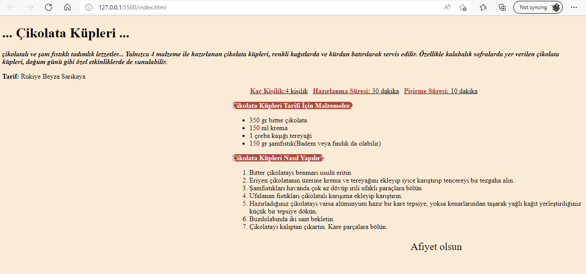

# kodluyoruz html Odev 3-2

[Patika.dev](https://www.patika.dev) Html eğitiminde 3/2.ödev. Alıştırmalar ve bölüm sonu çalışması.



## Installation
Öncelikle projeyi clonelayın.
```bash
git clone https:......git
```

## Usage
Projeyi cloneladıktan sonra Visual Studio Code programında açınız.

Linux için:
```linux
cd htmlOdev2
code .
```

## License
[MIT](https://choosealicense.com/licenses/mit/)
